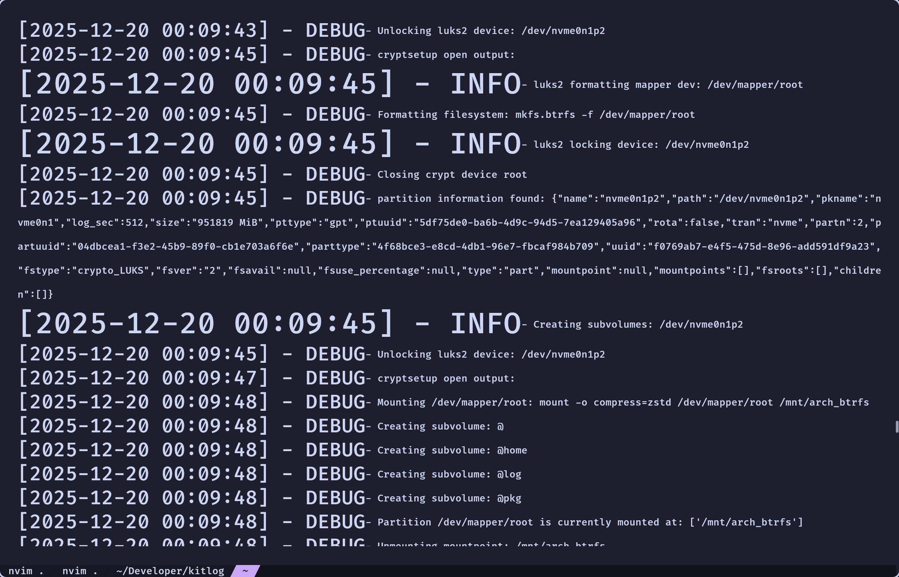

<picture>
  <source media="(prefers-color-scheme: dark)" srcset="./assets/preview.png" />
  
</picture>

<div align="center">
  <h1>kitlog</h1>
  <h3>A CLI log viewer that renders that scales the output based on severity.</h3>
  Exact appearance depends on your default font size and Kitty configuration.
</div>

---

## Overview

By using [Kitty’s OSC 66 text sizing protocol](https://sw.kovidgoyal.net/kitty/text-sizing-protocol/), kitlog turns plain terminal output into something closer to a semantic canvas. It's all still text, but much harder to miss or ignore when things ultimately go wrong.

This makes logs much easier to scan…and usually much more annoying, because once errors or warnings start ranting and raving, they dominate your screen and your attention.

We all like headers when rendering markdown. This project explores whether visual hierarchy belongs and to viewing logs.

> [!NOTE]
> This only works with any terminal emulators that support the text sizing protocol, which at the moment (I think) is only kitty.
---

## Supported Log Levels

The parser detects log levels case-insensitively anywhere in a line:

| Level | Keyword | Scale |
| ----- | ------- | ----- |
| Error | `error` | 5     |
| Warn  | `warn`  | 4     |
| Info  | `info`  | 3     |
| Debug | `debug` | 2     |
| Trace | `trace` | 1     |

The higher the scaling the larger the text renders.

---

## How it Works

1. Reads logs line-by-line (streaming, no buffering the whole file)
2. Uses a compiled regex to detect log level keywords
3. Splits each matching line into:

   * **Header** (timestamp / prefix)
   * **Message body**
4. Emits Kitty `OSC 66` escape sequences to scale the output

Lines without a recognized log level pass through unchanged.

---

## Usage

```bash
kitlog --help
Usage: kitlog <PATH>

Arguments:
  <PATH>  Path to a log file

Options:
  -h, --help     Print help
  -V, --version  Print version
```

---

## Future Plans

* Colors!
* Use `stdin` as input
* Add scaling values as arguments
* Possible config file?
